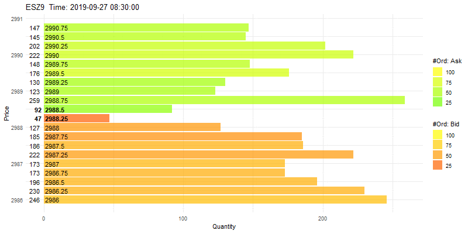

The OFOR and I are committed to developing user-friendly functions and packages both in R and Python, to reduce the workload of market data cleaning and enhance the quality of market data to improve the research in electronic trading and market microstructure.

[**cme.mdp: Clean and Analyze Chicago Mercantile Exchange Market Data in R**](https://github.com/richie-ma/cme.mdp) with Brian G. Peterson
* The goal of `cme.mdp` is to clean Chicago Mercantile Exchange (CME) market data with FIX protocol more easily (pretty user-friendly) in the R environment, including but not limited to trade summaries, quote updates, and limit order book reconstruction. This package is not restricted to only the agricultural futures markets, and it could be used in energy, metal, treasury, FX, and stock index futures as well.
* Market microstructure researchers can use this package to obtain high-quality market data that are ready to use for their research inputs. This package is user-friendly, and users tell where the data are stored and the results are in a good and easy-to-manipulate format. It can apply to any data products under FIX protocol, including Market by Price (MBP) and Market by Order (MBO). No strong prior knowledge is needed for the CME datasets.

[**cmemdp: Clean and Analyze Chicago Mercantile Exchange Market Data in Python**](https://github.com/richie-ma/cmemdp)
* The Python package `cmemdp` is inspired by the R package `cme.mdp`. The cmemdp covers almost all features in that package and it also includes other important functions, e.g., CME Packet Capture (PCAP) data cleaning.
* Market microstructure researcher can rely on the PCAP data parser to obtain huge amount of market data not only in a single futures market, where both MBP and MBO data are included. This is a cost-efficient way to acquire more data to support possible cross-market analyses, such as soybean complex. No strong prior knowledge is needed for the PCAP data.
