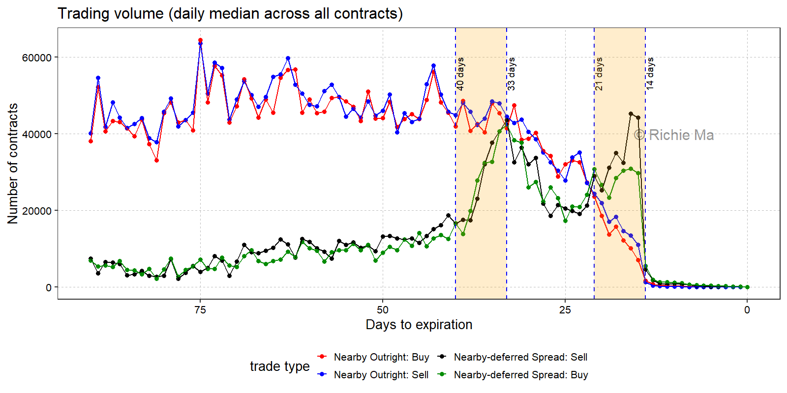

[← Go back](futures_blog.qmd)

# Futures contract rollover and calendar spreads
* Futures contract typically has a specific expiration date. Traders who do not want to take delivery need to close their positions before the expiration date.
  * Typically, futures FCM might remind their clients to close their positions before the First Notice Day, which is the first day when the exchange notifies the delivery matching. 
  * Traders who intend to maintain their long-term exposure needs to close their positions for the expiring contract (front-month leg) and open new positions for the next contract (back-month leg). This process is called "rollover". 

* However, even though it sounds like as simple as two trades in the market, there is still something to ask
  * When does rollover typically happen? Can data tell us a little? 
  * How to rollover? Just directly initiate two (outright) trades in the two contract months? Or is there any better way to do so? 
    * I find exchange-traded calendar spread contracts are pretty useful for this purpose. 
    
* Calendar spread contracts are traded in the futures markets and they represent the price difference between two contract months. For example, in the corn futures, the calendar spread contract is directly quoted as the price spread between two legs, such as -0.25 cents/bushel for the spread between December 2024 and March 2025 contracts.
  * Traders still receive **two outright positions**, instead of a (synthetic) spread combo.
  * A big advantage of trading calendar spreads is that the price spread between two legs is guaranteed.
   * This means the slippage cost is supposed to be smaller than trading two outright contracts.

* Spread trading is not a new thing in futures markets.
  * A paper by commodity research pioneer Holbrook Working. "Tests of a Theory Concerning Floor Trading on Commodity Exchanges." Food Research Institute Studies, Supplement to Vol. VII, (1967): 5 – 48.
  * Major difference may be that such spread contracts are executed by floor traders in the past, while they are executed electronically.

* I calculate the daily trading volume of calendar spread contracts (nearby--deferred) and that of (nearby) outright contracts in the corn futures market. 
  * I calculate this for each contract month from 2015 to 2024. The period is from 90 days to the final trading day.
  * I show both the buy trades and sell trades, expressed in the number of contracts. 

* A huge decline in trading volume is observed after 14 days. The magnitude is substantial, especially for calendar spreads. The daily median volume of calendar spreads is about 30K contracts, while it is only about 1K contracts after 14 days.  
* Outright market witnesses a more smoother decline in trading volume than calendar spread market.
* Sell trading volume is slightly higher than buy trading volume during the whole period.

* I highlight two periods where typical huge calendar spread volume can be observed:
  * The first is from 21 days to 14 days. This period is exactly one week before the First Notice Day. The daily median volume of calendar spreads is about 30K contracts, which is much higher than that of outright contracts (about 10K contracts). This suggests that many traders prefer to trade calendar spreads rather than outright contracts during this period.
    * This period is consistent with the conventional wisdom that traders typically roll their positions one week before the First Notice Day. The rollover does not seem to happen too late, like a few days before the expiration date. 
  * The second is from 40 days to 33 days. This period is about three to four weeks before the First Notice Day. We can see a huge increase in calendar spread volume, which is from 20K contracts to 40K contracts. This suggests that some traders might start to roll their positions even earlier than one week before the First Notice Day.
    

<!--Include social share buttons-->


Thoughts or questions?  
[Thoughts and questions](mailto:ruchuan2@illinois.edu?subject=Comment){.btn .btn-outline-primary}

